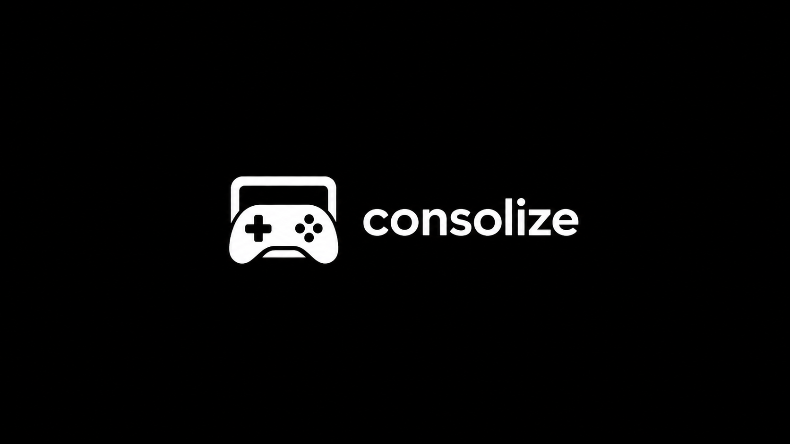

<p align="center">
  
</p>

<p align="center">
  <strong>Um console de jogos em Windows feito para o controle, que continua tendo desktop quando você precisa.</strong>
</p>

<p align="center">
  <a href="https://github.com/cybx/consolize/actions/workflows/ci.yml"></a>
  <a href="https://github.com/cybx/consolize/releases/latest"></a>
  
  <a href="LICENSE"></a>
</p>

<p align="center">
  <a href="README.md">English</a> · <strong>Português</strong>
</p>

<p align="center">
  <a href="#instalação">Instalação</a> ·
  <a href="#o-que-o-instalador-pergunta">Opções</a> ·
  <a href="#o-que-ele-muda-na-sua-máquina">O que ele muda</a> ·
  <a href="#como-funciona">Como funciona</a> ·
  <a href="#quick-settings">Quick Settings</a> ·
  <a href="#também-é-um-media-center">Mídia</a> ·
  <a href="#desinstalando">Desinstalar</a> ·
  <a href="docs/architecture.md">Arquitetura</a>
</p>

# Transforme o Windows num console

O consolize transforma um PC dedicado com Windows 11 num console de sala. Ele
liga direto no Steam Big Picture ou no Playnite Fullscreen, se recupera quando o
frontend cai, e mantém o desktop do Windows a uma ação de distância, alcançável
pelo controle.

Pense no Game Mode do SteamOS, para os jogos e o hardware que precisam do
Windows.

```powershell
irm https://get-consolize.cybx.dev | iex
```

O instalador pede elevação sozinho, pergunta o que você quer uma vez só,
prepara a máquina, cria uma conta dedicada para o console e conduz a instalação
através dos reinícios necessários.

## O que você ganha

| | |
|---|---|
| **Boot de console** | Login automático direto no Steam Big Picture ou Playnite Fullscreen, sem piscar o desktop |
| **Frontend que se recupera** | Um watchdog reinicia o frontend que caiu, e cai para o desktop em vez de deixar tela preta |
| **Desktop sob demanda** | Entra pela biblioteca da Steam; volta pelo ícone da bandeja ou pelo atalho na área de trabalho; reiniciar sempre volta para o modo console |
| **Quick Settings no controle** | Saída e volume de áudio, pareamento Bluetooth, wake pelo controle, wifi e controles de energia |
| **Windows em modo console** | Notificações silenciadas, updates controlados, boot silencioso, runtimes de jogo, ajuste de energia e limpeza opcional da inicialização |
| **Integração com o SteaMidra** | Instala opcionalmente a versão mais recente para Windows e adiciona ela à Steam automaticamente |
| **Caminho de volta seguro** | Um administrador separado mantém o desktop normal; scripts de resgate e desinstalação devolvem o Windows |

## O que o instalador pergunta

Uma entrevista, e depois ele roda sozinho atravessando os reinícios. Toda
resposta tem um padrão, então apertar Enter em tudo já entrega um console
funcionando.

| | Opções | Padrão |
|---|---|---|
| Nome e senha da conta do console | qualquer nome; a senha nunca fica em branco | `gamer` |
| Idioma da Steam, layout de teclado | qualquer idioma da Steam; o layout é perguntado separado e nunca deduzido do idioma | inglês, layout atual |
| Launchers | Steam, Playnite, Hydra, ou todos | Steam |
| Qual deles dá o boot | steam / playnite / hydra | steam |
| Updates do Windows | tudo / só segurança / pular | tudo |
| Software | runtimes, app da GPU, players de mídia, Java, Git e 7-Zip, qBittorrent | o conjunto recomendado |
| Media center | Kodi, Jellyfin, Plex, Stremio, e os sites de streaming | kodi, jellyfin |
| Defender | ajustar / desligar de vez / não mexer | ajustar |
| Botão de energia | dormir / hibernar | dormir |
| Elevação | quiet / off / prompt | quiet |
| Firewall | quiet / off / não mexer | quiet |

O único passo que precisa de você depois disso é o login na Steam, **dentro da
conta do console**, porque o Windows guarda esse login por usuário e nenhum
administrador consegue entrar em nome de outra conta.

## O que ele muda na sua máquina

Isso substitui o shell do Windows para uma conta e muda configurações da máquina
inteira, algumas delas reduzindo a segurança. Está tudo listado aqui em vez de
ser descoberto depois, e tudo é reversível com
[`uninstall-console.ps1`](setup/uninstall-console.ps1).

**O shell e a sessão**

| Mudança | Por quê | Como desfazer |
|---|---|---|
| O `Winlogon\Shell` da conta do console vira `consolize.exe` | essa conta liga no frontend em vez do Explorer | `disable-shell-launcher.ps1` |
| Autologon, com a senha guardada como segredo LSA | um console não pergunta quem é você | `set-autologon.ps1 -Remove` |
| Logo do Windows, animação de boot, telas de erro e timeout do menu de boot desligados | um console não te mostra o Windows no caminho | `boot-silent.ps1 -Restore` |
| Tela de login escondida (só no fim de uma instalação bem sucedida) | para que uma falha nunca esconda o caminho de volta | `rescue.ps1` |

**Silêncio**

| Mudança | Por quê | Como desfazer |
|---|---|---|
| Game Bar e Game DVR desligados, na máquina e no usuário | o botão guia pertence à Steam | `quiet-machine.ps1 -Restore` |
| Notificações, dicas e "termine de configurar seu dispositivo" desligados | nada aparece por cima do jogo | `quiet-user.ps1 -Restore` |
| Tela de bloqueio, protetor de tela e som de inicialização desligados | um console nunca interrompe o que está na tela | idem |
| Windows Update: instala às 04:00 e nunca reinicia com sessão aberta | ele não vai reiniciar no meio do filme | `quiet-machine.ps1 -Restore` |
| Teclado virtual abre sozinho em campos de texto | não existe teclado no sofá | `quiet-user.ps1 -Restore` |
| Papel de parede vira o splash do console | a imagem padrão quebra a ilusão | idem, mas a imagem anterior não é guardada |
| Itens de inicialização removidos (Run, RunOnce, pastas Startup, tarefas de logon) | opcional, com backup antes, e não toca no que é do próprio Windows | `clean-startup.ps1 -Restore` |

**Desempenho e energia**

| Mudança | Por quê | Como desfazer |
|---|---|---|
| Agendamento de GPU por hardware ligado, MMCSS ajustado para jogos | mensurável, e reversível | `tune-performance.ps1 -Restore` |
| Armazenamento reservado desligado (uns 7 GB de volta) | espaço no SSD do console | idem |
| `-Aggressive` também desliga Search, SysMain e DiagTrack | só se você pedir | idem |
| Botão de energia dorme ou hiberna, sem senha ao acordar, sem core parking, tela nunca apaga | a televisão cuida de apagar; apagar derruba o HDMI | `power-console.ps1 -Restore`, que grava o esquema anterior antes |

Ele deliberadamente **não** faz o que quase todo script de "otimização" faz:
`bcdedit useplatformclock`, desligar o pagefile, forçar timer resolution, mexer
no Nagle, debloat geral, desligar o agendamento de desfragmentação em SSD. Cada
um deles ou não faz nada ou causa exatamente o engasgo que promete resolver, e o
script diz isso na tela.

**Segurança, e essa parte vale ler duas vezes**

| Mudança | O que você perde | Como desfazer |
|---|---|---|
| Defender: pastas de jogo excluídas, varredura só quando ocioso | quase nada | `tune-defender.ps1 -Restore` |
| Defender **desligado por completo**, se você escolher | proteção em tempo real, e exige que você desligue a Proteção contra Adulteração na mão | idem |
| UAC `quiet`: administradores elevam sem prompt | qualquer coisa rodando na conta do console pode ganhar direitos de administrador sem te perguntar | `console-elevation.ps1 -Restore` |
| UAC `off`: `EnableLUA = 0` | o acima, e mais: tudo roda elevado desde o começo, níveis de integridade inclusive | idem |
| Firewall: entrada liberada no perfil privado, notificações desligadas | os jogos param de pedir, e o Windows também | `firewall-console.ps1 -Restore` |

Razoável para o console de uma pessoa numa sala de estar. Não para uma máquina
que outras pessoas usam, e não para a única conta de uma máquina de trabalho.
Deixar o Windows em paz é uma das respostas em cada uma dessas perguntas.

## Antes de instalar

Este projeto substitui o shell do Windows **para uma conta dedicada** e faz
mudanças na máquina inteira. Use num PC de jogos, num portátil ou numa VM de
teste, não na única conta de uma máquina de trabalho. Mantenha uma segunda conta
de administrador como caminho de recuperação.

O alvo principal de teste é o Windows 11 IoT Enterprise LTSC 2024. Home, Pro,
Education e o Enterprise comum usam o método padrão, o de registro; alguns
recursos opcionais de provisionamento variam por edição. Um teclado ainda é útil
para os primeiros logins do Windows e da Steam, mesmo que o uso do dia a dia seja
pensado para o controle.

## Por que não usar SteamOS ou Bazzite?

Eles são excelentes, e se tudo o que você joga roda sob Proton, provavelmente é
o que você deveria usar: fazem tudo isso nativamente e não precisam de projeto
nenhum para se comportar. Três motivos para alguém acabar aqui mesmo assim.

**Anticheat.** O bloqueio duro, e o único que ajuste nenhum resolve. Valorant,
Fortnite, Destiny 2, a maioria dos títulos da EA: anticheat de kernel não roda em
Linux, e os jogos não ficam "lentos" lá, eles simplesmente se recusam a abrir.

**Desempenho no hardware AMD atual.** A suposição antiga de que o Linux empata
ou ganha do Windows não se sustenta em RDNA 4 hoje. Testes agregados numa RX 9070
XT colocam o Bazzite em [92% do Windows](https://en.gamegpu.com/news/zhelezo/sravnenie-proizvoditelnosti-rx-9070-xt-i-rtx-5080-v-windows-11-i-linux-v-2026-godu)
(127,9 contra 138,6 FPS de média), com o CachyOS em 94%.

Mas cuidado com esse número. É uma média, e por título o quadro é genuinamente
misto: numa 7900 XTX em 4K, o SteamOS
[ganha em Cyberpunk 2077 e Spider-Man 2](https://www.notebookcheck.net/Cyberpunk-2077-and-Red-Dead-Redemption-2-tested-at-4K-Ultra-on-SteamOS-and-Windows-11-offering-a-snapshot-of-Linux-gaming-in-2026.1201785.0.html)
enquanto o Windows leva Forza Horizon 5 com folga. A GamersNexus, que rodou o
conjunto mais amplo de RDNA 4,
[se recusa a comparar os próprios números](https://gamersnexus.net/gpus/rip-windows-linux-gpu-gaming-benchmarks-bazzite)
entre os dois sistemas, e aponta problemas de compatibilidade, crashes e travadas
de compilação de shader como o que de fato molda a experiência. Ou seja: uma
vantagem real na média com silício AMD novo, não uma goleada.

**Hardware novo, no dia do lançamento.** Uma GPU nasce com driver de Windows. O
suporte em Linux chega quando o kernel e o Mesa alcançam, que é exatamente a
lacuna em que a RDNA 4 passou quase todo o primeiro ano.

### O que você perde, honestamente

Suspender e retomar, com uma ressalva que importa. O problema não é o sleep em
si: em hardware que expõe S3 de verdade, ele funciona bem, e é o padrão do
[`power-console.ps1`](setup/power-console.ps1). A dor é o Modern Standby (S0ix),
que é a maioria dos notebooks e portáteis novos, onde o Windows entra nele de
forma pouco confiável e acorda por motivos que ninguém pediu. Num Steam Deck,
onde o S3 é comandado pelo firmware, o Windows não é significativamente pior que
o SteamOS nesse ponto.

A hibernação é oferecida para as máquinas em que o sleep não é confiável, e vale
ser honesto sobre o que ela custa. Ela não é um desligamento: a RAM é gravada em
disco e o estado dos processos volta. Mas o estado de dispositivo e de rede não
volta. Um jogo pode bater em perda de dispositivo D3D ao retomar, uma sessão
online já foi derrubada pelo servidor faz tempo, e alguns módulos de anticheat
não gostam do intervalo. Ou seja: a hibernação sobrevive a uma queda de energia,
não te devolve ao meio de uma partida.

E você precisa deste projeto, enquanto o SteamOS já vem com a experiência de
console pronta.

## Por que Windows 11 IoT Enterprise LTSC?

Qualquer edição funciona. O LTSC é o alvo de desenvolvimento e teste porque vem
enxuto (sem Widgets, Copilot, Teams ou apps da Store) e só recebe atualizações de
qualidade, então nenhuma atualização de recurso vai quebrar a sua sala.

### Como conseguir

Vale dizer com todas as letras, porque é a primeira parede que as pessoas batem:
**o IoT Enterprise LTSC não é vendido no varejo.** Não existe caixinha nem página
de loja. Ele é licenciado por dispositivo através dos distribuidores IoT
autorizados da Microsoft (Arrow, Avnet, Advantech e afins) ou por licenciamento
por volume.

Dois caminhos honestos:

- **Para experimentar:** a Microsoft publica uma
  [avaliação gratuita de 90 dias](https://www.microsoft.com/en-us/evalcenter/evaluate-windows-11-iot-enterprise-ltsc)
  do Windows 11 IoT Enterprise LTSC. Dá para montar a máquina, rodar o consolize
  e decidir se a ideia toda serve para você.
- **Para ficar:** um distribuidor IoT autorizado, para uma licença de um
  dispositivo, ou licenciamento por volume se você já tiver contrato.

Se você obtiver uma ISO de qualquer terceiro, compare o SHA-256 com a
[lista de hashes publicada pela Microsoft](https://cdn-dynmedia-1.microsoft.com/is/content/microsoftcorp/microsoft/final/en-us/microsoft-brand/documents/Windows11IoTEnterpriseLTSC2024EvalHashValues.pdf)
antes de inicializá-la. O consolize não recomenda imagens modificadas nem ativação
sem licença; a avaliação acima é o caminho seguro para testar antes de comprar.

E a parte que poupa o trabalho da maioria: **você não precisa do LTSC.** O método
padrão de troca de shell é um valor de registro por usuário e funciona igual no
Home e no Pro. O que o LTSC te dá é uma instalação mais enxuta e ausência de
atualizações de recurso, não um console funcionando. Se você já tem Windows 11 na
máquina, use ele.

### Como o shell é substituído

Dois mecanismos, e o padrão é o que mantém o modo desktop funcionando:

| | `-Method registry` (padrão) | `-Method shelllauncher` |
|---|---|---|
| O que faz | Escreve o valor `Shell` do Winlogon por usuário, na hive daquela conta | O recurso Shell Launcher (`WESL_UserSetting`) |
| Edições | todas, Home e Pro inclusive | Enterprise, Education, IoT Enterprise |
| Reiniciar ao sair | o `AutoRestartShell` do Winlogon | embutido, com ação por código de retorno |
| **Modo desktop** | **funciona**: nenhum shell fica registrado, então abrir o `explorer.exe` faz ele assumir, com barra de tarefas e tudo | **não funciona**: a Microsoft [afirma](https://learn.microsoft.com/en-us/answers/questions/5576492/) que ali o explorer abre uma janela de pasta, não um desktop |

O consolize é o próprio watchdog e nunca sai de propósito, então o tratamento de
reinício do Shell Launcher vale menos para ele do que conseguir chegar no
desktop. O session manager confere se a barra de tarefas apareceu depois de abrir
o explorer, e registra no log quando ela não aparece, em vez de te deixar olhando
para uma pasta.

## Como funciona

O `consolize.exe` é um pequeno session manager em .NET que **é** o shell de uma
conta dedicada:

1. Ele abre o frontend configurado (Steam Big Picture por padrão; Playnite
   Fullscreen, Hydra ou qualquer executável via config).
2. Ele vigia o frontend e reabre se cair, com um freio de crash-loop que cai para
   o desktop em vez de ficar batendo para sempre.
3. O "modo desktop" é sob demanda, do jeito que o SteamOS faz, e alcançável sem
   teclado:
   - **console para desktop:** existe uma entrada "Desktop Mode" na biblioteca da
     Steam, adicionada durante a instalação. Escolha pelo controle e o Explorer
     abre.
   - **desktop para console:** o session manager mostra um ícone na bandeja
     enquanto o desktop está no ar (dois cliques), e a instalação também deixa um
     atalho "Back to Console Mode" na área de trabalho.
   - reiniciar sempre volta para o console, então uma sessão deixada em modo
     desktop nunca é uma armadilha.
4. Ele expõe um named pipe (`ping`, `status`, `desktop`, `console`, `restart`,
   `sleep`, `panel`, `quit`) para scripts e ferramentas futuras controlarem a
   sessão.

### Quick Settings

O `consolize panel` abre um painel em tela cheia feito para controle: direcional
ou analógico esquerdo para mover, A para escolher, B para fechar, LB e RB para
trocar de página. Ele entra na biblioteca da Steam na instalação, então é
alcançável do sofá.

| Página | O que faz |
|---|---|
| Audio | Troca o dispositivo de saída (TV, fone, receiver) e ajusta o volume |
| Bluetooth | Procura, pareia e esquece dispositivos sem abrir as Configurações |
| Controllers | Quantos controles estão conectados, e quais dispositivos podem acordar a máquina |
| Network | Conecta numa rede wifi salva |
| Power | Voltar ao console, modo desktop, reiniciar frontend, dormir, reiniciar, desligar |

A página Controllers cobre a configuração que decide se um botão do controle liga
o console de volta. Ela morava no Gerenciador de Dispositivos, que é exatamente
onde um controle não chega. Só vale para **dormir**: nada no USB acorda uma
máquina hibernada, então com `-RestMode Hibernate` é o botão do gabinete ou um
adaptador HDMI-CEC.

O `consolize panel --diag` imprime o que ele consegue enxergar (dispositivos de
áudio, rádio Bluetooth, disponibilidade de XInput) sem abrir janela, que é o jeito
rápido de conferir uma máquina.

O que ele **não** é: uma tarefa agendada abrindo um VBS que abre um batch, nem
uma sequência de sleeps de 20 segundos torcendo para o frontend já estar de pé. O
único valor de registro que ele escreve é o `Winlogon\Shell` por usuário citado
acima, que é a forma documentada de dar outro shell a uma conta, e o
[`disable-shell-launcher.ps1`](setup/disable-shell-launcher.ps1) desfaz.

## Situação

| Fase | O quê | Situação |
|---|---|---|
| F1 | Session manager (shell com watchdog + desktop sob demanda) | **pronto** |
| F2 | Camada de silêncio (Game Bar off, DND, disciplina de updates, autologon via LSA, UI de boot) | **pronto**, e reversível com `-Restore` |
| F3 | Energia: modo de descanso (perfil dormir/hibernar, wake pelo controle, sem core parking) | **pronto**; o `-Restore` grava o esquema anterior antes de mudar |
| F4 | Quick settings feito para controle (pareamento Bluetooth, saída de áudio, volume, wifi) sem tocar num desktop | **pronto** |
| F0 | Provisionamento: bootstrap de jogos (driver de GPU, runtimes, updates) + `autounattend.xml` | **bootstrap pronto**, autounattend pendente |
| F5 | Manutenção remota (OpenSSH, segunda conta admin, desinstalação limpa) | desinstalação e resgate **prontos**; acesso remoto ainda em aberto |
| F6 | Mídia: seus próprios apps na biblioteca, YouTube, e um media center | **pronto** |

Verificado em hardware até aqui: tudo até a troca de shell. Quatro coisas seguem
provadas só em VM, ou nem isso, e estão listadas honestamente em
[docs/architecture.md](docs/architecture.md) em vez de presumidas aqui.

## Instalação

Na máquina que vai virar o console:

```powershell
irm https://get-consolize.cybx.dev | iex
```

Não precisa abrir o PowerShell como administrador: ele pede elevação sozinho e
continua na janela elevada. A instalação desliga o QuickEdit, então clicar dentro
daquela janela não pausa o instalador em silêncio.

Aquele endereço é um Worker do Cloudflare na frente deste repositório, que lê pela
API de conteúdo do GitHub, para que uma correção publicada há um minuto seja a que
roda; o `raw.githubusercontent.com` guarda cache por minutos, o bastante para
rodar o código de ontem sem querer. O código dele está em
[`cloudflare/worker.js`](cloudflare/worker.js).

Ele instala o `consolize.exe` e todos os scripts de setup, e então roda o
provisionamento inteiro, perguntando antes de cada parte. Você responde uma
entrevista curta uma vez; tudo depois disso é automático, incluindo o reinício e a
troca de conta de que ele precisa.

Os scripts são copiados para a máquina na hora da instalação, então uma correção
publicada depois não chega sozinha. Para puxar os atuais sem começar de novo:

```powershell
& ([scriptblock]::Create((irm https://get-consolize.cybx.dev))) -UpdateOnly
```

Do próprio console existe uma entrada **Update consolize** na biblioteca da Steam,
que faz a mesma coisa mais os upgrades do winget, e oferece o reinício.

### O que a conta do console pode fazer

Ela instala e joga, pareia Bluetooth, entra no wifi e troca a saída de áudio sem
que nada disso precise de elevação. Uma coisa precisa: jogos com anticheat de
kernel (Fortnite, Apex, Rainbow Six) instalam um serviço de sistema na primeira
vez que abrem.

Esse único caso decide o tipo da conta, porque o Windows lida com ele de duas
formas igualmente ruins. Uma conta padrão recebe um pedido de **usuário e senha**
de administrador, que não se digita no controle. Uma conta de administrador recebe
só Sim ou Não, mas o prompt é desenhado na área de trabalho segura, que ignora
entrada injetada por design, então a emulação de mouse da Steam não consegue
clicar.

O [`console-elevation.ps1`](setup/console-elevation.ps1) oferece três respostas, e
todas tornam a conta do console administradora, sem o que nenhuma delas funciona:

| | o que faz |
|---|---|
| `quiet` (padrão) | UAC ligado, mas administradores elevam sem serem perguntados. Nada pergunta, e os programas continuam abrindo sem privilégio. |
| `off` | UAC desligado por completo (`EnableLUA = 0`). Também não pergunta nada, mas tudo roda elevado desde o começo, níveis de integridade inclusive. |
| `prompt` | UAC ligado e ainda perguntando, mas fora da área de trabalho segura, para um mouse emulado conseguir responder. |

O `quiet` é o padrão porque ele pergunta tão pouco quanto o `off`, ou seja, a
experiência no sofá é idêntica, enquanto os programas continuam abrindo sem
privilégio. Um jogo que dá errado fica em integridade média em vez de ter dominado
a máquina desde que abriu, e os sandboxes do navegador e dos apps empacotados, que
são construídos sobre níveis de integridade, continuam funcionando.

A troca, sem rodeio: tanto `quiet` quanto `off` significam que qualquer coisa
rodando nessa conta pode ganhar direitos de administrador sem te perguntar.
Razoável para o console de uma pessoa numa sala; não para uma máquina que outras
pessoas usam. A instalação pergunta, e deixar o Windows em paz é uma das respostas.

(O `off` costumava quebrar a Store e os apps empacotados. Isso foi corrigido no
build 15063 do Windows 10, então não se aplica mais.)

Todo o resto é resolvido antes e não na hora: o passo de `runtimes` instala todas
as gerações do VC++, DirectX, .NET e o resto justamente para que um jogo nunca
tenha que instalar um pré-requisito no meio da abertura.

### Duas contas, e por quê

A conta com que o Windows foi instalado mantém o desktop normal e continua sendo
seu caminho de volta. Uma segunda conta (`gamer`, por padrão) é a única cujo shell
é substituído.

A instalação se conduz sozinha através dessa fronteira, que ela precisa cruzar
porque o Windows guarda o login da Steam por usuário e nenhum administrador pode
entrar em nome de outra conta:

1. Tudo que é da máquina inteira roda a partir das suas respostas, e a máquina
   reinicia.
2. Ela entra na conta do console sozinha e uma janela termina aquela conta:
   configurações por usuário, depois a Steam, esperando você entrar com o
   "Lembrar de mim" marcado. Essa é a única tela que precisa de você.
3. Uma tarefa do SYSTEM percebe que a conta está pronta, roda o preflight,
   substitui o shell e reinicia no modo console.

No primeiro reinício o Windows pode mostrar a janela azul do PowerShell sem texto
por um instante, enquanto o `powershell.exe` sobe do zero e o perfil novo se
acomoda. Nenhum script consegue desenhar antes desse processo estar pronto. Assim
que a fase 2 começa ela imprime `consolize: starting the first-logon setup...` e
mantém todo o resto do trabalho na mesma janela; ela não fecha e reabre outro
PowerShell que parece vazio. O QuickEdit é desligado direto no console vivo pela
API do Windows, além de nas configurações salvas da conta, então um clique sem
querer também não congela essa fase.

Se o login da Steam nunca acontecer, o passo 3 se recusa a trocar o shell e diz por
quê: ligar numa tela de login que um controle não consegue preencher te deixaria
preso. Cancele uma instalação em andamento com `.\setup-console.ps1 -Abort`.

**Se você acabar olhando para uma tela preta**, `Ctrl+Shift+Esc` abre o
Gerenciador de Tarefas por cima de qualquer shell. Arquivo > Executar nova tarefa,
marque "Criar esta tarefa com privilégios administrativos", e rode:

```
powershell -ExecutionPolicy Bypass -File "C:\Program Files\Consolize\setup\rescue.ps1"
```

Isso devolve a tela de login, o desktop e as mensagens de boot de uma vez, e
cancela o que ainda estiver agendado. A tela de login só é escondida no finalzinho
de uma instalação bem sucedida, justamente para que uma falha nunca esconda o
caminho de volta.

### Colocando seus próprios apps na biblioteca

A Steam consegue adicionar um jogo não-Steam sozinha, mas isso pede mouse e
navegador de arquivos, e uma máquina que liga no Big Picture não tem nenhum dos
dois. De um terminal no modo desktop:

```powershell
cd 'C:\Program Files\Consolize\setup'
.\add-app-shortcut.ps1 -Name 'RetroArch' -Exe 'C:\RetroArch\retroarch.exe'
.\add-app-shortcut.ps1 -List
```

Ele ganha capa e cai na coleção **Consolize** junto com o resto. A lista fica em
`C:\ProgramData\Consolize\shared\extra-shortcuts.json`, então é reaplicada a cada
atualização em vez de ser coisa de uma vez só.

Tirar um app da lista não tira ele da biblioteca: uma entrada que não bate mais
com nada que o consolize conheça não dá para distinguir de uma que você adicionou
na mão. Para limpar todas: `add-console-shortcuts.ps1 -Remove -Force`, e depois
rodar de novo sem o `-Remove`.

### YouTube na televisão

O `bootstrap-gaming.ps1` oferece, ou sozinho:

```powershell
.\install-youtube.ps1
```

O caminho óbvio não funciona, e vale saber disso antes de tentar. A interface de TV
do YouTube é um app web em `youtube.com/tv`, mas o Google bloqueia navegadores ali
a menos que se identifiquem como console ou TV, e o truque de trocar o user-agent
te dá a interface **sem suporte a controle**: as setas funcionam e o controle não
faz nada. A maioria das receitas que circulam é anterior ao bloqueio.

Então isso instala o [VacuumTube](https://github.com/shy1132/VacuumTube), que
embrulha essa mesma interface oficial em Electron, se identifica como o app de TV
do YouTube e implementa a entrada de controle ele mesmo. MIT, mantido ativamente,
não está no winget, então vem do release do GitHub. Ele ganha uma entrada na
biblioteca como todo o resto.

Entre com **Configurações > Vincular com código de TV**, em vez de digitar senha
numa televisão.

### SteaMidra

A entrevista de software oferece o [SteaMidra](https://github.com/Midrags/SFF)
como integração opcional. O consolize encontra o release mais recente no GitHub,
confere o SHA-256 publicado pela plataforma, baixa o ZIP para Windows, extrai com
o 7-Zip em `C:\Program Files\SteaMidra` e adiciona o **SteaMidra** à Steam como
app não-Steam.

Como o SteaMidra precisa de direitos de administrador, essa entrada passa pelo
broker de elevação do Windows. No modo de elevação `quiet`, que é o padrão, ele
abre como administrador sem prompt; no modo `prompt`, aparece o Sim/Não fora da
área de trabalho segura, para o mouse emulado pelo controle conseguir responder.
A Steam mantém a entrada marcada como aberta até o SteaMidra fechar. Para instalar
ou atualizar separadamente:

```powershell
.\install-steamidra.ps1
```

### Também é um media center

O `bootstrap-gaming.ps1` oferece, ou sozinho:

```powershell
.\install-htpc.ps1
.\install-htpc.ps1 -Apps kodi,jellyfin -Services netflix,primevideo
```

Duas categorias, e elas se comportam de forma diferente:

**Players** (Kodi, Jellyfin Media Player, Plex HTPC, Stremio) são aplicativos de
verdade. O Kodi lê controle nativamente, então é o que realmente parece um
console, e ele tem add-on de Jellyfin e de Plex se você preferir uma porta de
entrada só.

**Serviços de streaming** (Netflix, Prime Video, Disney+, Max, Globoplay,
Crunchyroll) não têm mais aplicativo nativo de Windows. O "app" da Netflix na
Microsoft Store é um app web do Edge desde 2024, então no LTSC, que não tem Store,
não se perde nada abrindo o site direto no Edge com `--app`: uma janela sem abas,
sem barra de endereço e sem botão voltar por cima do filme, cada serviço no
próprio perfil para continuarem logados separadamente.

Edge e não Chrome ou Firefox, de propósito. A Netflix entrega 1080p e 4K só para
navegadores que conseguem usar PlayReady, que no Windows quer dizer Edge (o Chrome
ganhou isso há pouco no Windows 11, o Firefox segue travado em 720p). Pegar 720p
numa televisão por causa do navegador seria um jeito estranho de perder.

O porém, dito com todas as letras: **um app web não lê controle.** Configure em
Steam > Configurações > Controle > Desktop layout um perfil com mouse no analógico
direito, e amarre um atalho para o teclado na tela na hora de fazer login. Os
players nativos não precisam de nada disso.

### Desinstalando

O `rescue.ps1` é para uma instalação que deu errado, e só desfaz o que pode
esconder a tela. Para remover o consolize por completo:

```powershell
& 'C:\Program Files\Consolize\setup\uninstall-console.ps1'
```

Ele devolve o shell primeiro, para que uma falha em qualquer passo seguinte ainda
deixe uma máquina em que você consegue entrar, e então restaura Defender, firewall,
UAC, plano de energia, inicialização e as camadas de silêncio, e remove as tarefas
agendadas, as entradas da biblioteca da Steam e os arquivos instalados. Passe
`-WhatIfOnly` para ver o plano sem executar.

A conta do console é **mantida** a menos que você passe `-RemoveAccount`, porque
ela é dona da biblioteca da Steam, dos saves e dos prints. `-RemoveAccount
-DeleteProfile` leva isso junto.

O que já estiver normal é pulado, então rodar duas vezes é seguro. O que ele não
consegue recuperar é uma configuração que já tinha valor diferente do padrão antes
do consolize rodar: essas foram sobrescritas sem serem registradas, e o script diz
isso em vez de fingir o contrário.

Tudo abaixo é o caminho manual, a partir do código; cada script também funciona
sozinho.

## Início rápido (bancada, sem trocar o shell)

Dá para experimentar o session manager dentro de uma sessão normal primeiro:

```powershell
dotnet publish src/Consolize.SessionManager -c Release -r win-x64 -o out/publish
./out/publish/consolize.exe          # o Big Picture abre, watchdog ativo
Start-Process ./out/publish/consolize.exe -ArgumentList 'send status'  -NoNewWindow -Wait
Start-Process ./out/publish/consolize.exe -ArgumentList 'send desktop' -NoNewWindow -Wait
Start-Process ./out/publish/consolize.exe -ArgumentList 'send quit'    -NoNewWindow -Wait
```

`Start-Process -Wait` em vez de chamada direta de propósito: o `consolize.exe` é um
binário do subsistema gráfico, para que sendo o shell ele nunca pisque uma janela
de console, e o PowerShell não espera por esses. Um `consolize send status` direto
ainda imprime, só que chega depois do prompt voltar e não dá para capturar numa
variável.

A configuração fica em `%LOCALAPPDATA%\Consolize\config.json` (criada no primeiro
uso, com `%ProgramData%\Consolize\config.json` como alternativa da máquina
inteira), e os logs em `%LOCALAPPDATA%\Consolize\logs\`.

**Convencendo um frontend teimoso:** o `FrontendArgs` substitui os argumentos
embutidos. O Big Picture é Chromium e quer GPU, então numa máquina sem aceleração
3D (uma VM comum do Hyper-V, por exemplo) ele trava ou renderiza preto até você
desligar isso:

```json
{ "Frontend": "steam", "FrontendArgs": "-cef-disable-gpu -bigpicture" }
```

**Sua própria logo de boot:** coloque um `splash.png` ao lado de qualquer uma das
configs e o session manager mostra ela em tela cheia enquanto o frontend abre,
fechando no instante em que o frontend desenha a primeira janela. Como o
`boot-silent.ps1` remove a logo do Windows, é isso que a máquina mostra ao ligar.

## Tornando o shell de verdade

> **Aviso:** você está substituindo o shell do Windows de um usuário. Faça isso numa conta dedicada, mantenha uma segunda conta de administrador com o shell padrão, e leia os scripts antes de rodar. Alvo testado: Windows 11 IoT Enterprise LTSC 2024.

```powershell
# como admin, da raiz do repo, na máquina que vai virar o console
./setup/bootstrap-gaming.ps1              # updates, driver de GPU, runtimes, launchers, players, ferramentas; interativo com padrões recomendados (instala o winget sozinho se faltar)
./setup/quiet-machine.ps1                 # nada aparece por cima do jogo, updates às 04:00, boot silencioso
./setup/tune-defender.ps1                 # pastas de jogo excluídas, varredura só ociosa (use -Disable para desligar o Defender de vez)
./setup/tune-performance.ps1              # HAGS, perfil MMCSS de jogo, armazenamento reservado (use -Aggressive para cortar serviços de fundo)
./setup/power-console.ps1                 # botão de energia = modo de descanso, sem senha ao acordar, sem core parking
./setup/clean-startup.ps1                 # nada inicia com o Windows além do próprio console (reversível)
./setup/boot-silent.ps1                   # sem logo do Windows, sem tela de boas-vindas, sem diálogos de erro de boot

# entre na Steam uma vez com "Lembrar de mim" antes do passo seguinte, então:
./setup/preflight.ps1 -UserName gamer     # pega as armadilhas do primeiro boot enquanto ainda existe desktop
./setup/set-autologon.ps1 -UserName gamer # autologon com a senha guardada como segredo LSA (nunca em texto puro)
./setup/install.ps1                       # compila e instala o consolize.exe
./setup/enable-shell-launcher.ps1 -UserName gamer

# uma vez, dentro da sessão do gamer (sem admin):
./setup/quiet-user.ps1                    # botão guia vai para a Steam, notificações off, dicas off

# opcional, a qualquer momento depois:
./setup/add-app-shortcut.ps1 -Name 'RetroArch' -Exe 'C:\RetroArch\retroarch.exe'
./setup/install-youtube.ps1                # a interface de TV do YouTube, no controle
./setup/install-htpc.ps1                   # Kodi, Jellyfin, Plex, e os sites de streaming

# desfazer, tudo de uma vez:
./setup/uninstall-console.ps1              # use -WhatIfOnly para ver o plano antes
```

Cada peça continua se desfazendo sozinha (`disable-shell-launcher.ps1`,
`set-autologon.ps1 -Remove`, `tune-defender.ps1 -Restore`, e `-Restore` no resto),
que é o que o `uninstall-console.ps1` chama, na ordem que mantém a máquina
acessível em todo passo.

Veja [docs/architecture.md](docs/architecture.md) para as decisões de projeto e o
roadmap completo.

## Créditos

O consolize se apoia em ideias e software da comunidade de Windows e de jogos de
sala:

- O [GamesDows](https://github.com/jazir555/GamesDows), de
  [jazir555](https://github.com/jazir555), foi pioneiro na ideia de ligar o
  Windows direto no Steam Big Picture ou no Playnite como experiência de console.
  O consolize é uma implementação do zero e não reaproveita código do GamesDows.
- O [SteaMidra](https://github.com/Midrags/SFF), feito por Midrag e seu irmão,
  está disponível como integração opcional de terceiros. O consolize baixa o
  release oficial e cria a entrada na biblioteca da Steam; o SteaMidra continua
  sendo um projeto GPL-3.0 separado, com documentação e termos próprios.
- O [VacuumTube](https://github.com/shy1132/VacuumTube), de
  [shy1132](https://github.com/shy1132), fornece a experiência opcional de YouTube
  de TV com suporte a controle, instalada pelo `install-youtube.ps1`.
- Obrigado a todo mundo que reporta esquisitice de hardware, testa instalações
  limpas do Windows e contribui com correções. Issues e pull requests são bem
  vindos.

Steam e SteamOS são marcas da Valve Corporation. Windows é marca da Microsoft
Corporation. O consolize é um projeto independente e não tem vínculo nem aval da
Valve, da Microsoft, do GamesDows, do SteaMidra ou do VacuumTube.

## Licença

[MIT](LICENSE) © 2026 Victor Corrêa.
